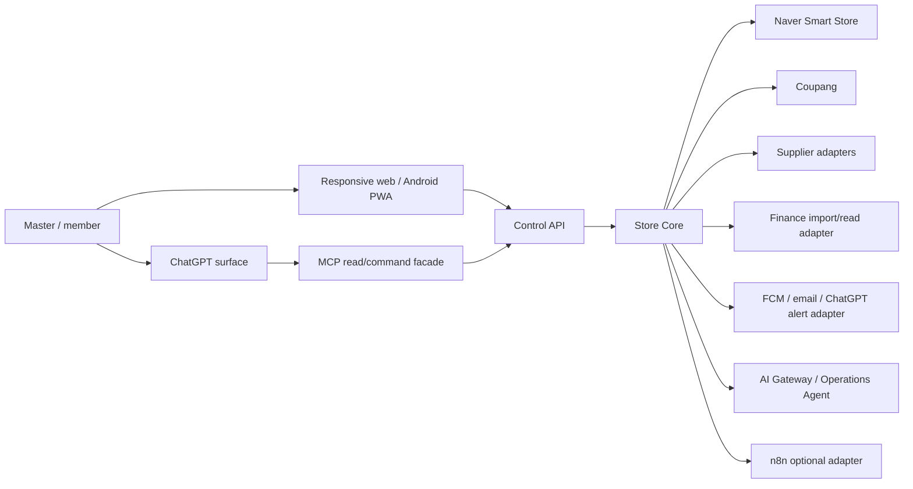

# D-01. System context, containers, deployment

## Context



External systems are untrusted dependencies. Webhooks are notifications, not truth: verify signature/replay where available and re-read the external record before applying a state change.

## Containers and ownership

| Container | Responsibility | Must not do |
|---|---|---|
| Ops Console/PWA | dashboard, approval, incident, read views | hold secrets or call vendors directly |
| Control API/BFF | session, tenant context, API shaping | bypass policy |
| Control Plane | users, roles, policies, approvals, budgets, stops, audit | mutate business facts without command contract |
| Store Core | catalog, offers, inventory, pricing, OMS, procurement, claims, settlement | call channel APIs directly |
| Tool Gateway | typed command validation, authorization, policy, idempotency | expose raw DB/vendor operations |
| Adapter workers | channel/supplier/finance/notification I/O, retries, reconciliation | own canonical business state |
| Workflow/queue | outbox delivery, schedules, long-running order/claim timers | become source of truth |
| AI Gateway/Agent | observe-decide-act-verify, model routing, token ledger | make unbounded side effects |
| PostgreSQL | transaction ledger, projections, events, outbox | store plaintext secrets |
| Object storage | immutable source files, receipts, media versions, export artifacts | become mutable ledger |

## Component boundaries

`Store Core` modules: Catalog → Offer → Inventory/Pricing → Order → Procurement → Fulfillment → Claim → Settlement. `Control Plane` cross-cuts all modules through `tenant_id`, authorization, policy version, approval, and audit. Adapters implement anti-corruption mappings and never leak vendor enums into core schemas.

## Deployment topology (GCP Seoul preferred)

```text
Android PWA/Web/ChatGPT
          |
   HTTPS/API Gateway
          |
 Cloud Run: control-api  ---- Cloud Run: worker
          |                         |
   Cloud SQL PostgreSQL       queue/scheduler/outbox
          |                         |
 Cloud Storage (encrypted)  Secret Manager + KMS
          |
 OTel/logs/metrics --> alerting --> FCM/email
```

Scale-to-zero is acceptable for non-urgent work. Urgent alert delivery, outbox draining, and order deadlines require a wake-up path and must not depend on an always-on in-memory process. Exact service choice is an implementation decision under the cost gate; the contracts are portable.

## Runtime modes

| Mode | Writes | Credentials | Badge |
|---|---|---|---|
| DEMO | simulator only; no vendor side effects | fixture references | DEMO |
| SHADOW | external reads only | read-only where possible | LIVE / SHADOW |
| LIVE | policy/approval bounded writes | tenant-scoped secret refs | LIVE |

LIVE requires verified business information and channel authentication. Without a supplier, product registration may proceed only if channel rules permit it; purchase is blocked.
