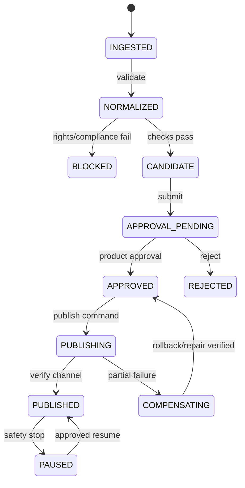
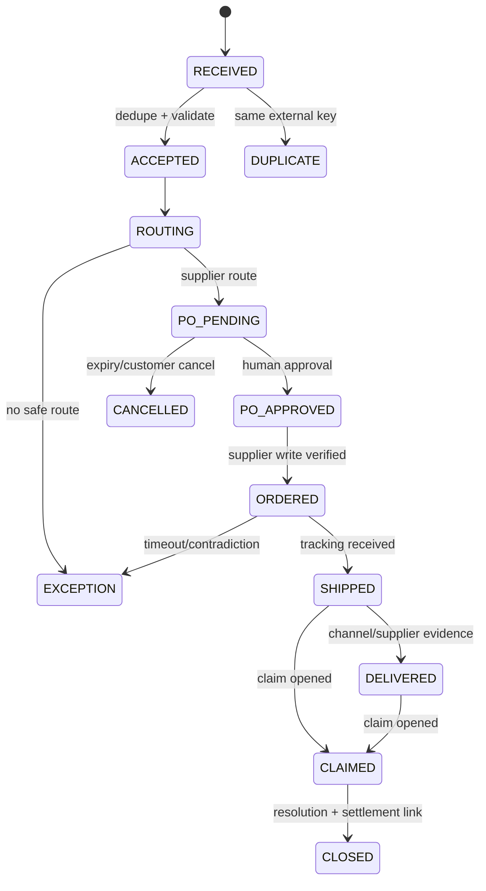

# D-04. State machines and compensation

State names are stable API values. A transition is accepted only with `aggregate_version`, actor, reason, policy version, and idempotency key. On success, update projection and append event atomically.

## Catalog/product and offer

`BLOCKED` is mandatory for missing supplier business/return data or clear infringement. Ambiguous rights produce a warning and approval request, not an automatic block.

For content, preserve the original asset and create versioned transformations for resize, background removal, color, and text layout. Generated backgrounds are optional and must not alter product facts. Video is proposed only when configured sales/view thresholds or a high-need rule is met, and only rights-cleared assets can be published.

## Sales order, purchase, fulfillment

`SupplierPurchaseOrder` has its own `DRAFT → APPROVAL_PENDING → APPROVED → SUBMITTED → ACKNOWLEDGED → CANCEL_REQUESTED/CANCELLED` flow. One `ChannelOrder` can have multiple POs and shipments; a partial PO failure does not roll back a successfully acknowledged PO. It creates an incident and compensating command.

## Claim and settlement

Claim keeps independent statuses: `consumer_status`, `channel_status`, `supplier_status` (`OPEN → EVIDENCE_PENDING → APPROVED/REJECTED → REFUND_PENDING → REFUNDED → CLOSED`). Settlement is `IMPORTED → PARSED → MATCHING → RECONCILED | EXCEPTION → ADJUSTED → CLOSED`.

Projected profit is calculated at offer/order time; realized profit is calculated after channel settlement, supplier cost, advertising, content/AI cost allocation, and returns. Never overwrite projection with realized values.

## Safety and compensation rules

| Failure | Immediate action | Compensation / follow-up |
|---|---|---|
| channel publish partially succeeds | mark `PUBLISHING/COMPENSATING`; stop retries for unknown result | re-read by external key; update or archive projection; incident |
| supplier PO timeout | no blind retry | query by idempotency/reference; retry only if absence proven |
| price/stock goes stale or margin <10% | temporarily pause offer | re-sync; approval for final sell-state |
| channel cancel after supplier order | create cancel request; preserve customer order | supplier cancel/return workflow; claim/settlement adjustment |
| refund succeeds but webhook lost | reconciliation sees external truth | append missing event, no second refund |
| worker restart | lease expires; job requeued | resume from durable state, not memory |

All external writes use deterministic key `tenant_id + operation + aggregate_id + logical_version`; retries use same key. Verification is a required terminal step, not best effort.
